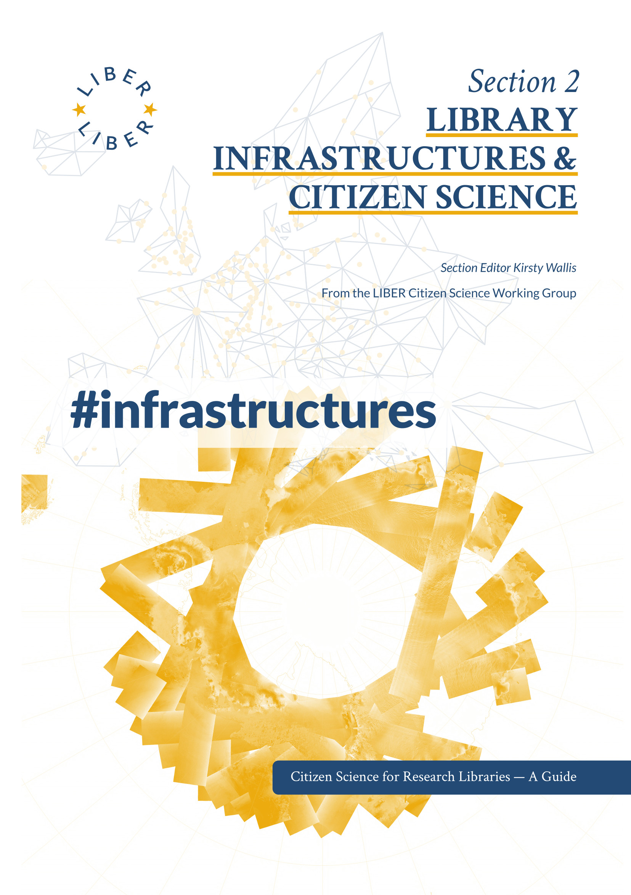

About the Book

    

      <h2 id="H1638982">Library Infrastructures and Citizen Science</h2>
      
Section Editor Kirsty Wallis

      
v1.0, 2023

      
Series: Citizen Science for Research Libraries — A Guide

      

      

      

      
<strong>Co-Editors-in-Chief:</strong> Thomas Kaarsted &amp; Simon Worthington. Correspondence <a href="mailto:simon.worthington@tib.eu" title="simon.worthington@tib.eu">simon.worthington@tib.eu</a>. <strong>Editors:</strong> Alisa Martek and Dragana Janković. <strong>Reviewers:</strong> Dr Raphaëlle Bats, Sara Decoster, Mitja V. Iskrić, Jitka Stilund Hansen, and Dominic Tate. <strong>Editorial Committee:</strong> Paul Ayris (Chair), Bastian Greshake Tzovaras, Jitka Stilund Hansen, and Kirsty Wallis.

      
DOI:<strong>&nbsp;</strong><a href="https://doi.org/10.25815/tz0x-m353" title="https://doi.org/10.25815/tz0x-m353">10.25815/tz0x‑m353</a> | ISBN Print:<strong>&nbsp;</strong>978‑87‑94233‑57‑6 e‑book:<strong>&nbsp;</strong>978‑87‑94233‑58‑3 | Wikidata: <a href="https://www.wikidata.org/wiki/Q118313412" title="https://www.wikidata.org/wiki/Q118313412">Q118313412</a>

      
Web: <a href="https://cs4rl.github.io/infrastructure/" title="https://cs4rl.github.io/infrastructure/">cs4rl.github.io/infrastructure</a> | Source: <a href="https://github.com/cs4rl/infrastructure" title="https://github.com/cs4rl/infrastructure">github.com/cs4rl/infrastructure</a> | Series: <a href="https://libereurope.eu/working-group/liber-citizen-science-working-group/citizen-science-guide/" title="https://libereurope.eu/working-group/liber-citizen-science-working-group/citizen-science-guide/">libereurope.eu/cs4rl</a> 

      
Published by LIBER Citizen Science Working Group. 

      
Collaborations: SciStarter and ECSA.

      
Copyright © 2023 the authors. Publication, articles, and images licensed under a Creative Commons Attribution-ShareAlike 4.0 International License – (<a href="https://creativecommons.org/licenses/by-sa/4.0/" title="https://creativecommons.org/licenses/by-sa/4.0/">CC BY-SA</a>) unless otherwise stated.

      
Multi-format production: #NextGenBooks – Open Science Lab, <a href="https://github.com/TIBHannover/ADA. " title="https://github.com/TIBHannover/ADA. ">TIB – ADA Publishing Pipeline</a>. CSS template production courtesy Raquel Perez de Eulate, Interpunct Studios – <a href="https://interpunct.dev/" title="https://interpunct.dev/">Interpunct.dev</a>. Design based on template design: Geralda van der Es/ SPRESSO.

      
Code – <a href="https://github.com/cs4rl/guide/LICENSE" title="https://github.com/cs4rl/guide/LICENSE">GNU General Public License v3.0</a>. Data – All data and data sets produced are <a href="https://creativecommons.org/publicdomain/zero/1.0/" title="https://creativecommons.org/publicdomain/zero/1.0/">CC0</a>, Public Domain.

      
Print and PDF design template (CC BY-SA). Multi-format template (CC BY-SA). Fonts: CrimsonText and Lato, these fonts are licensed under the SIL <a href="https://scripts.sil.org/OFL" title="https://scripts.sil.org/OFL">Open Font License </a>(OFL). Free and Open Source Software used in production – Fidus Writer (GNU AFFERO GPL), Vivliostyle (GNU AFFERO GPL).

      
Cover image: European Space Agency (ESA), ASAR global monitoring <a href="https://www.esa-photolibrary.com/ESA/media/20377" title="https://www.esa-photolibrary.com/ESA/media/20377">Mode of the Antarctic</a>. The material is ESA copyright and is supplied to you free of charge on the following <a href="https://www.esa-photolibrary.com/ESA/info2.do" title="https://www.esa-photolibrary.com/ESA/info2.do">terms and conditions</a>. Find out more about <a href="https://earth.esa.int/eogateway/missions/envisat/descriptionmissions/envisat/description" title="https://earth.esa.int/eogateway/missions/envisat/descriptionmissions/envisat/description">Envisat here</a>.

    

